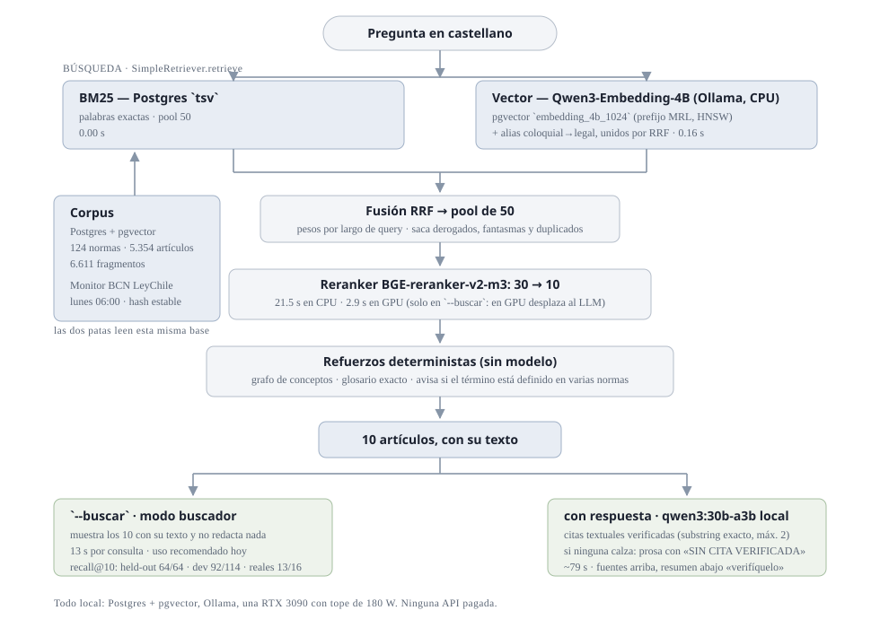

# Energy-RAG — buscador de normativa eléctrica chilena

Buscador sobre la normativa eléctrica de Chile (Biblioteca del Congreso Nacional, BCN): recibe una
pregunta en castellano y devuelve **los artículos que la responden, con su texto**. Si se le pide,
además redacta un resumen, pero solo con **citas textuales verificadas** contra el artículo citado.

Todo corre **en local**: Postgres + pgvector, Ollama (embeddings y LLM), una RTX 3090.
**Ninguna API pagada.**



## Para qué sirve hoy, y para qué no

- **Sí:** buscador interno, con una persona que lee la fuente. El artículo correcto aparece entre
  los 10 que muestra en **64/64** preguntas de fraseo formal, **92/114** del set de desarrollo
  (que incluye 50 coloquiales) y **13/16** preguntas reales sacadas de SEC / CGE / Coordinador.
- **No:** responder solo a terceros. Cuando se equivoca, el error típico es una cita textual de un
  artículo real que **no** es el que responde — pasa el verificador y casi nunca avisa (en las
  preguntas reales, 5 de 6 errores salieron sin advertencia).

Los números están medidos y son reproducibles; los genera `scripts/estado.py`, no están escritos
a mano. El detalle, en [`docs/sistema/06-resultados-y-limites.md`](docs/sistema/06-resultados-y-limites.md).

## Empezar

```bash
git clone <este repo> && cd energy-rag-postgres-rag
python3 -m venv venv && venv/bin/pip install -r requirements.txt
cp .env.example .env            # host/puerto/credenciales de Postgres y LLM_DEFAULT
docker start energy_rag_pg      # Postgres 16 + pgvector (el sistema lo levanta solo si se cae)
ollama serve                    # necesita qwen3:30b-a3b y el embedder Qwen3-Embedding-4B
venv/bin/alembic upgrade head
```

Preguntar:

```bash
export PYTHONPATH=. HF_HUB_OFFLINE=1 HF_HOME=/home/alonso/datos/hf

# modo buscador: solo los artículos, 13 s
venv/bin/python scripts/preguntar.py --buscar "¿me pueden cortar la luz si debo mes y medio?"

# con resumen redactado, ~79 s
venv/bin/python scripts/preguntar.py "¿me pueden cortar la luz si debo mes y medio?"

# vistas derivadas del corpus
venv/bin/python scripts/preguntar.py --obligaciones coordinador
venv/bin/python scripts/preguntar.py --plazos | --cambios | --procesos | --impacto ID | --bitacora

# los números del sistema, generados
venv/bin/python -m scripts.estado
```

## Cómo funciona, en una pasada

1. **BM25** sobre Postgres (`tsv`) y **vector denso** con Qwen3-Embedding-4B vía Ollama, guardado
   en pgvector como prefijo MRL de 1024 dimensiones (indexable con HNSW). Las dos patas leen el
   mismo corpus; los alias coloquial→legal agregan una búsqueda extra y se unen por RRF.
2. **Fusión RRF** con pesos según el largo de la pregunta (corta → BM25, larga → vectores) y
   descarte de artículos derogados, duplicados y fantasmas.
3. **Reranker** BGE-reranker-v2-m3: de 30 candidatos deja 10.
4. **Refuerzos deterministas, sin modelo:** grafo de conceptos, inyección del artículo de glosario
   cuando el término calza exacto, y aviso cuando el término está definido en varias normas.
5. **Redacción** (opcional) con `qwen3:30b-a3b` local, temperatura 0: cada cita debe ser un
   fragmento **textual** del artículo citado, máximo 2. Si ninguna calza, entrega prosa marcada
   «SIN CITA VERIFICADA».

El corpus **se actualiza solo**: un monitor corre los lunes a las 06:00, re-baja las normas del
dominio desde BCN, compara un hash estable del texto y aplica los cambios con guardas contra
scrapes a medias. Ver [`docs/sistema/03-actualizacion-bcn.md`](docs/sistema/03-actualizacion-bcn.md).

## Documentación

**Empezar por [`docs/sistema/`](docs/sistema/README.md)** — es la verdad vigente, dividida por tema:

| tema | responde a |
|---|---|
| [01 · Arquitectura](docs/sistema/01-arquitectura.md) | ¿qué pasa entre la pregunta y la respuesta? |
| [02 · Corpus y datos](docs/sistema/02-corpus-y-datos.md) | ¿qué hay en la base, qué defectos tuvo, cómo se revierte? |
| [03 · Actualización BCN](docs/sistema/03-actualizacion-bcn.md) | ¿cómo se entera de que una ley cambió? |
| [04 · Evaluación](docs/sistema/04-evaluacion.md) | ¿cómo se mide y qué trampas tiene medir? |
| [05 · Operación](docs/sistema/05-operacion.md) | ¿cómo se usa, cómo se corren experimentos, cómo se cuida la GPU? |
| [06 · Resultados y límites](docs/sistema/06-resultados-y-limites.md) | ¿qué tan bien funciona y qué falta? |

`docs/bitacora/` es la historia (handoffs, campañas y `plan-operacion.md`): qué se probó, cuándo y
con qué resultado. No hace falta leerlos para entender el sistema.

## Estructura del repo

```
src/
├── pipelines/      retrieve.py (búsqueda) · generate.py (redacción) · grounding, prompts, grafo
├── components/     vectorstore (Postgres+pgvector) · embedder · reranker · llm
├── extraction/     artículos, definiciones, obligaciones, plazos, referencias
├── parsers/        estructura del articulado y limpieza de notas marginales de BCN
├── crawlers/       norm_detail_crawler.py (Playwright + stealth) — el único vigente
└── core/           config.py: los defaults SON la configuración adoptada

scripts/
├── preguntar.py            punto de entrada de uso
├── red_golden.py           red de prueba: prueba un refactor sin re-medir
├── estado.py               los números del sistema, generados
├── exp_think_paired.py     harness del eval (pareado + McNemar)
├── *.sh                    10: los 7 del crontab + tope de GPU + drenar la cola
├── INDICE.md               qué hace cada uno de los 34 .py y 10 .sh vivos
├── experimentos/           87 experimentos ya decididos (los docs los citan como evidencia)
└── archivo/                155 herramientas de un solo uso y drivers de campañas cerradas

data/         eval/ (sets + red golden) · intents/ · normas_completas/ · salida del crawler
data/archivo/ datos de la v1 que ningún código vivo lee (con README)
docs/sistema/ documentación vigente por tema
docs/bitacora/ historia: handoffs, campañas, plan-operacion.md
tests/        pytest (7 fallas preexistentes conocidas: ver docs/sistema/05)
```

## Probar un cambio sin romper nada

El pipeline es **determinista** (temperatura 0, una muestra), así que un refactor no se discute:
se prueba. Si la salida cambia, el refactor cambió el comportamiento.

```bash
# red de búsqueda (~15 min): los 10 artículos de las 194 preguntas
PYTHONPATH=. venv/bin/python -m scripts.red_golden --salida /tmp/nueva.json
PYTHONPATH=. venv/bin/python -m scripts.red_golden --comparar \
    data/eval/redes/busqueda_base.json /tmp/nueva.json     # exit 1 si cambió un solo puesto
```

Las reglas de medición (criterio escrito antes, dev **y** held-out, misma huella de corpus) están
en [`docs/sistema/04-evaluacion.md`](docs/sistema/04-evaluacion.md). Se aprendieron a golpes: una
corrida del monitor que cambia el corpus invalida toda comparación anterior.

## Hardware y límites

- RTX 3090 con tope de **180 W** (`scripts/gpu_guard.sh`): la placa se cayó del bus 6 veces y el
  tope no le quita velocidad medible. `scripts/gpu_vigia.sh` registra temperatura, vatios y MHz.
- El cuello es la **RAM (14 GB)**, no la VRAM: el embedder 4B corre en CPU para no desplazar al LLM,
  que ocupa 22 de los 24.5 GB de VRAM con contexto de 32768.
- Un modelo denso de 27B **no cabe** (25 GB, se desborda a CPU, 5-25 min por respuesta).
- Escala: BM25 y el vector no crecen con el corpus (el reranker siempre ve 30 documentos), pero la
  descarga desde BCN tiene un throttle obligatorio de 20 s por norma y el embedding está en CPU.
  Análisis con números medidos en [`docs/bitacora/handoff-2026-09-27.md`](docs/bitacora/handoff-2026-09-27.md).

## Licencia y datos

El texto de las normas es público y proviene de [BCN LeyChile](https://www.bcn.cl/leychile).
Este repositorio es trabajo personal; **no es asesoría legal**: la salida siempre hay que
verificarla en la fuente.
